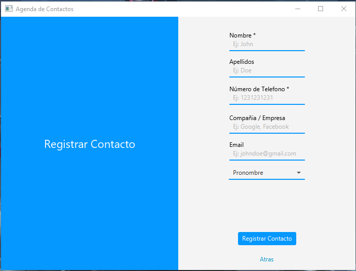
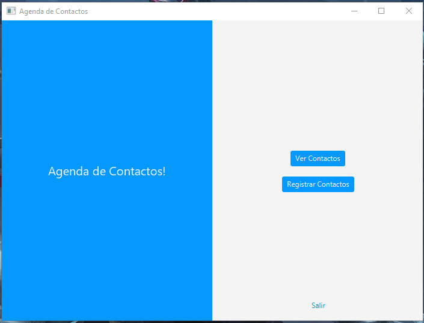
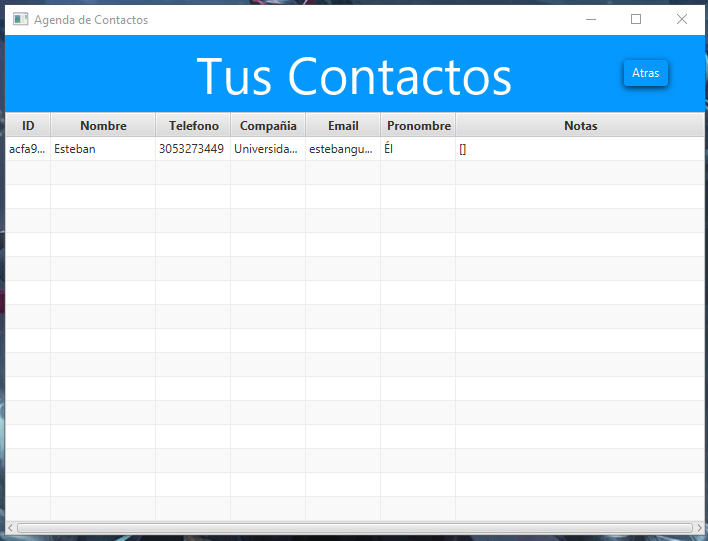

# Contact Agenda

This is a **Contact Agenda** project developed in **Java** using **JavaFX** for the graphical user interface and **SQLite** for data persistence. The system allows users to register, view, and manage contacts, with features like custom notes and inclusive pronoun selection.

## 🚀 Features

- **Contact Registration**: Create new contacts with fields such as name, last name, phone number, email, and pronoun.
- **Contact Visualization**: Dynamic table to display all registered contacts stored in the database.
- **Contact Management**: Edit existing contact information and add custom notes to each contact.
- **Inclusive Pronouns**: Supports a wide range of pronouns for better representation.

## 🛠️ Technologies Used

- **Java 17**
- **JavaFX** for the graphical user interface
- **SQLite** for data persistence
- **Maven** for project dependency management

## 📝 Requirements

- Java 17 or later
- Maven installed
- SQLite database (automatically created on first run)

## 📦 Installation

1. Clone the repository:
   ```bash
   git clone https://github.com/estebangmz666/contactList.git
   ```
2. Navigate to the project directory:
   ```bash
   cd contact-agenda
   ```
3. Build and run the project using Maven:
   ```bash
   mvn clean javafx:run
   ```

## 📖 How to Use

1. Launch the application.
2. Use the **Register Contacts** button to add a new contact with their details.
3. Navigate to **See Contacts** to view and manage your list of contacts.
4. Double-click a contact to open the **Contact Management** view, where you can edit details and add notes.

## 🎨 Screenshots

### Contact Register View


### Main Dashboard View


### Contact Dashboard View



## 🤝 Contributions

Feel free to contribute by submitting issues or pull requests. Any contributions to improve the project are welcome!

## 📄 License

This project is licensed under the MIT License. See the [LICENSE](LICENSE) file for details.
